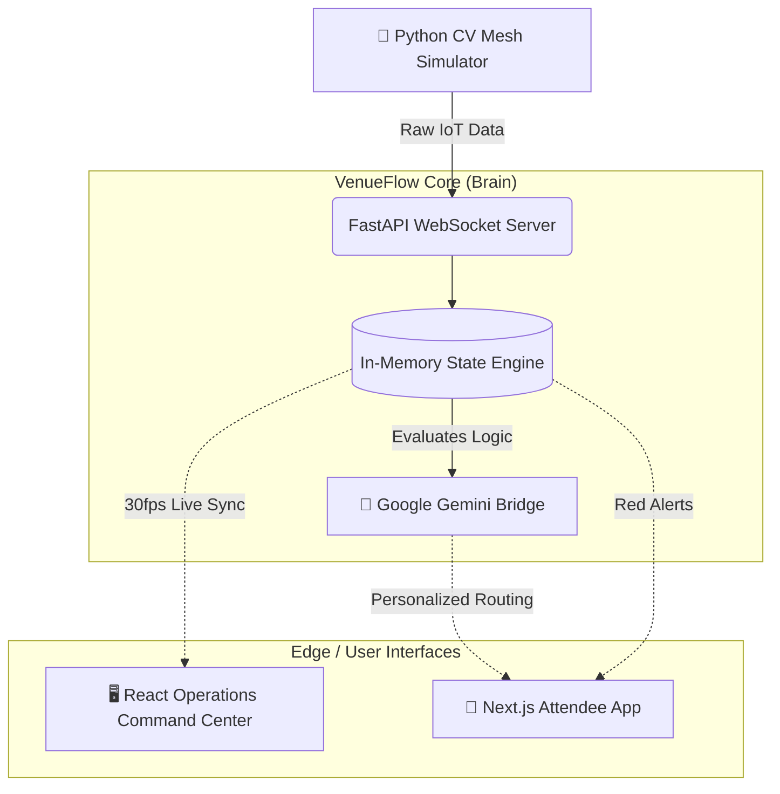

<div align="center">
  
# 🏟️ VenueFlow
**The AI-Native Stadium Nervous System**

[](#)
[](#)
[](#)
[](#)

*Synchronizing millions of square feet. Re-routing crowds in milliseconds. Saving lives instantly.*

---

</div>

## 🧨 The Problem: The Stadium "Black Box"
Modern stadiums operate blindly. Bottlenecks at gates, multi-hour wait times at concessions, and highly dangerous evacuation blind spots ruin the live entertainment experience and threaten public safety.

## 💎 The VenueFlow Solution
VenueFlow is a bidirectional nervous system for large-scale venues. By networking stadium security cameras into a real-time **Computer Vision mesh array**, VenueFlow uses **Generative AI** to instantly re-route crowds, deploy staff, execute dynamic flash sales, and automatically manage mass evacuations without human latency.

---

## 🔥 God-Tier Features Matrix

| Feature | Technology | Impact |
| :--- | :--- | :--- |
| **Multi-Camera CV Mesh 📸** | OpenCV / WebSockets | VenueFlow natively understands real pax density and crowd sentiment across millions of square feet in real-time, completely replacing guess-work. |
| **AI "Ops Concierge" 🧠** | Google Gemini LLM | Attendees query an AI ("Where is the fastest burger?"). The AI reads the live camera mesh and issues a customized AR route instantly. |
| **Predictive Flash Sales 💸** | AI Analytics | 10 mins before a game ends, VenueFlow dynamically pushes targeted UI alerts urging attendees to use empty exits in exchange for Uber discounts. |
| **"Hype Squad" Dispatch 🎉** | Sentiment Analysis | If a concession line generates heavy frustration (angry sentiment), the AI automatically dispatches the mascot with free merch to that GPS coordinate. |
| **Instant Red-Alerts 🚨** | Distributed System | In a crisis, the system executes a `< 1 second` venue-wide override. All Attendee apps lose commerce features and display pulsing emergency evacuation routes. |

---

## 🏗️ Technical Architecture

<div align="center">



</div>

---

## 🚀 Presentation Guide (Running Locally)

For Hakathon Judges and Evaluators: This repository contains everything needed for the end-to-end demo.

### 1. Boot the AI Engine (Terminal 1)
```bash
cd venueflow-backend
python -m venv venv
# Activate the venv (env\Scripts\activate on Windows)
pip install -r requirements.txt
uvicorn main:app --host 0.0.0.0 --port 8000
```

### 2. Boot the Edge Displays (Terminal 2)
```bash
cd venueflow-frontend
npm install
npm run dev
# Open http://localhost:3000 to view the Operations Portal
```

### 3. Initiate the "God-Mode" CV Simulator (Terminal 3)
```bash
cd venueflow-backend
python cv_simulator.py
```

> **✨ MAGIC TRICK:** Once `cv_simulator.py` is running, use your keyboard's **Number Pad (1-4)** in that terminal to act as "God" during the pitch. You can manually trigger massive AI re-routing events, emergency screen-overrides, and Mascot dispatches that actively manipulate the frontend interfaces live in front of the judges!

---

<div align="center">

*Engineered with precision for the Hackathon Finals.* 🏆

</div>
