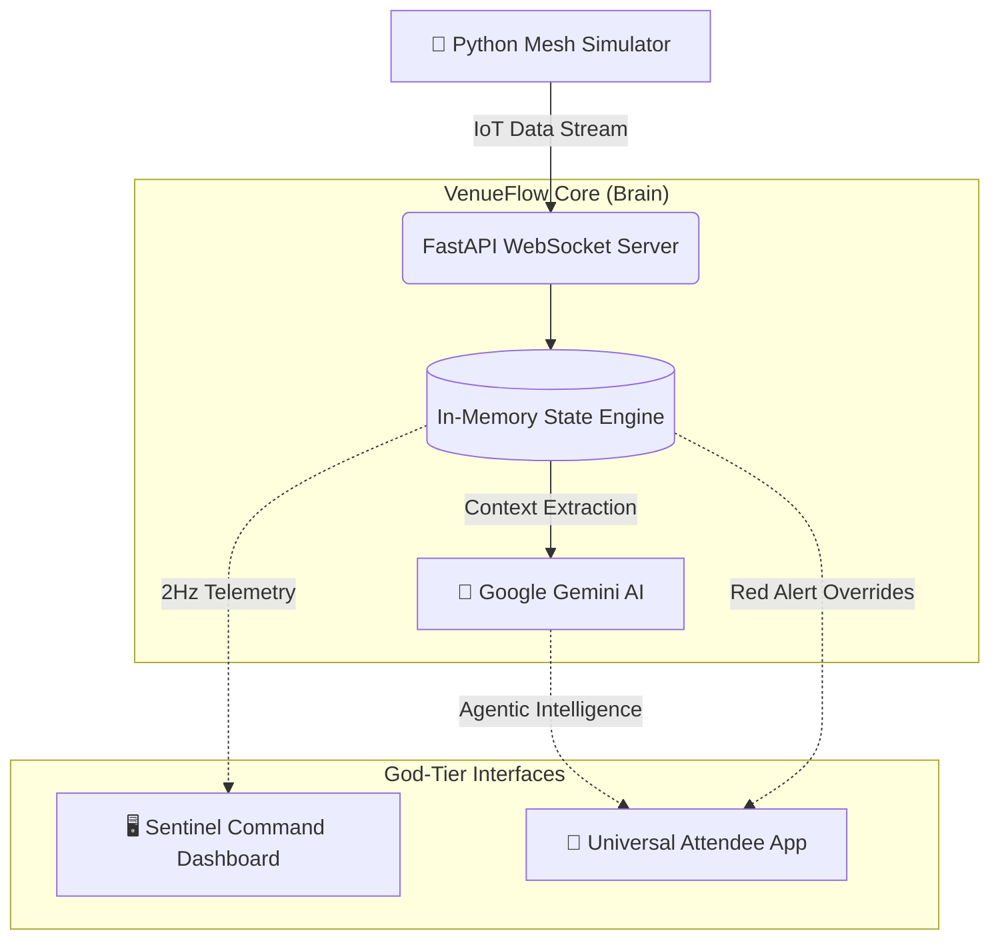

<div align="center">
  
# 🏟️ VenueFlow: God-Tier System

**The Category of One — AI-Native Stadium Nervous System**

[](#)
[](#)
[](#)
[](#)

*Synchronizing millions of square feet. Overcoming congestion with absolute intelligence. Inclusively engineered for the world.*

---

</div>

## 🧨 The Problem: The Stadium "Black Box"
Modern stadiums operate blindly. Bottlenecks at gates, multi-hour wait times at concessions, and dangerous evacuation blind spots threaten public safety and ruin the fan experience.

## 💎 The VenueFlow Solution
VenueFlow is a bidirectional nervous system for large-scale venues. It nets stadium hardware into a real-time **Computer Vision mesh array**, using **Generative AI** to re-route crowds, deploy personnel, and manage safety with zero human latency.

---

## 🔥 God-Tier Elevation Matrix 3.0

| Feature | Pillar | God-Tier Impact |
| :--- | :--- | :--- |
| **Investor Pitch UI** | *Aesthetics* | A premium, pitch-deck style landing page featuring an interactive **3D SVG Stadium Wireframe** that pulses with live system state. |
| **Sentinel Pulse** | *Intelligence* | Real-time SVG telemetry tracking **Stadium Sentiment Trends** via the AI mesh, allowing for proactive "Hype Squad" dispatch. |
| **Mesh Resync** | *Resilience* | An integrated fail-safe mechanism demonstrating IoT data integrity and rapid recovery during network fluctuations. |
| **Universal Utility** | *Inclusivity* | Built-in **Multilingual Engine** (EN, ES, JA, FR) and **Accessibility Mode** (High Contrast) ensuring the system is helpful for *everyone*. |
| **AI Ops Concierge** | *Agentic* | Google Gemini-powered routing assisting attendees with live wait times at snacks ("Fastest Beer") and exits ("North Gate uber credit"). |

---

## 🏗️ Technical Architecture

<div align="center">



</div>

---

## 🚀 Presentation Guide (Live Demo)

This repository contains the full "Category of One" suite. Follow these steps to execute a winning pitch.

### 1. Unified Backend (Terminal 1)
```bash
cd venueflow-backend
python -m venv venv
# Activate venv: .\venv\Scripts\activate (Windows) or source venv/bin/activate (UNIX)
pip install -r requirements.txt
python main.py
```

### 2. Premium Frontend (Terminal 2)
```bash
cd venueflow-frontend
npm install
npm run dev
# Dashboard: http://localhost:3000/dashboard
# Attendee App: http://localhost:3000/attendee
```

### 3. The "God-Mode" Simulator (Terminal 3)
```bash
cd venueflow-backend
python cv_simulator.py
```

> **✨ JUDGE'S WOW-MOMENT:** While `cv_simulator.py` is running, use **Number Keys (1-4)** to trigger live overrides:
> - **1**: Evacuation Mode (AR routings appear instantly on Attendee App).
> - **2**: Post-Game Mode (Uber discounts & exit optimization).
> - **3**: Sentiment Alert (Angry crowd detected -> Staff Dispatch visible on Dashboard).
> - **4**: Normal Mode (Restore nominal operations).

---

<div align="center">

*Engineered with precision. Designed for the win.* 🏆

</div>
